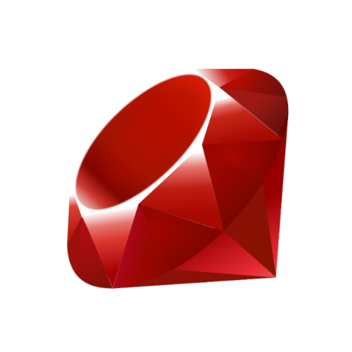

### About me

Lorem ipsum dolor sit amet, consectetur adipisicing elit, sed do eiusmod
tempor incididunt ut labore et dolore magna aliqua. Ut enim ad minim veniam,
quis nostrud exercitation ullamco laboris nisi ut aliquip ex ea commodo
consequat. Duis aute irure dolor in reprehenderit in voluptate velit esse
cillum dolore eu fugiat nulla pariatur. Excepteur sint occaecat cupidatat non
proident, sunt in culpa qui officia deserunt mollit anim id est laborum.

Lorem ipsum dolor sit amet, consectetur adipisicing elit, sed do eiusmod
tempor incididunt ut labore et dolore magna aliqua. Ut enim ad minim veniam,
quis nostrud exercitation ullamco laboris nisi ut aliquip ex ea commodo
consequat. Duis aute irure dolor in reprehenderit in voluptate velit esse
cillum dolore eu fugiat nulla pariatur. Excepteur sint occaecat cupidatat non
proident, sunt in culpa qui officia deserunt mollit anim id est laborum.

### Machine Languages

  
  
  
  
  

### Human Languages

  
  

  
Projects
 <blockquote style="padding: 0;">

  

  

  ### Ruby Gems

  * [Sorcery v1 Rework](https://github.com/sorcery/sorcery-rework)
  * [Sorcery Argon2 Wrapper](https://github.com/sorcery/argon2)
  * [Validator Matchers](https://github.com/athix/validator-matchers)
  * [RuboCop Athix](https://github.com/athix/rubocop-athix)

  

  

  

  ### Other Projects

  * [Stepper Motor Music](https://github.com/athix/stepper-motor-music)
  * [MCU PPM Input](https://github.com/athix/mcu-ppm-input)
  * [Shift Register Chasing Lights](https://github.com/athix/shift-register-stuff)
  * [Knight's Tour](https://github.com/athix/knights-torus)

  

  

</blockquote>

